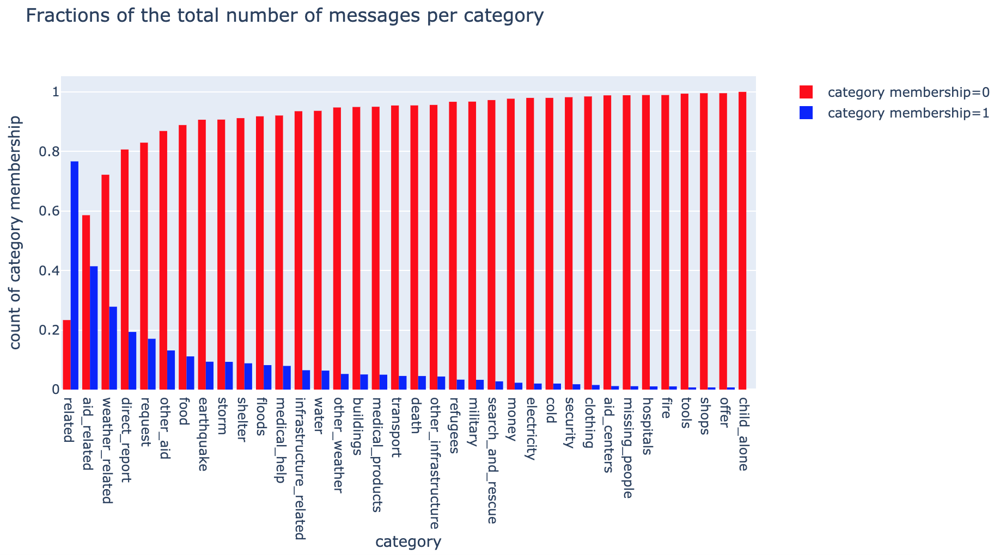

# Disaster-Prone NLP

This project uses natural language processing to categorize tweets received during a disaster (e.g. a hurricane or bombing) such that aid groups can know when and where to provide targeted help during the emergency.

### Table of Contents
1. [Usage](#usage)
2. [Project Motivation](#motivation)
3. [File Descriptions](#files)
4. [Modeling Details](#model)
4. [Licensing, Authors, and Acknowledgements](#licensing)

## Usage 

The web app resulting from this project can be found [here](#). It is designed to allow a user to input a text message and receive a category (or multiple categories) that the text is best described by (e.g. "Medical Help", "Food", or "Shelter").

If you would like to run the code locally instead of using the web app:

1. Run the following commands in the project's root directory to set up your database and model.

    - To run the ETL pipeline that cleans data and stores in sqlite3 database:
        `python data/process_data.py data/disaster_messages.csv data/disaster_categories.csv data/DisasterResponse.db`
    - To run the ML pipeline that trains a classifier and saves the resulting model:
        `python models/train_classifier.py data/DisasterResponse.db models/classifier.pkl`

2. Run the following command in the app's directory to run the web app using the model created:
    `python run.py`

3. Go to http://0.0.0.0:3001/ in your browser

## Project Motivation 

I completed this project as part of the [Udacity Data Scientist Nanodegree](https://www.udacity.com/course/data-scientist-nanodegree--nd025), but I was extra-motivated to work on this as it's a tangible opportunity to work on a data science project that really matters. Getting people the help they need in a disaster using data that are realistically available during such disasters is a noble goal. Hopefully my work can, in some small way, help someone down the road.

## File Descriptions 

A number of scripts and data files are utilized to make this project a reality:

1. `notebooks/`
	1. `ETL Pipeline Preparation.ipynb`: a Jupyter notebook exploring options for ETL pipeline
	2. `ML Pipeline Preparation.ipynb`: a Jupyter notebook testing different modeling pipelines
2. `models/`
    1. `09-20-2019_RandomForest.joblib`: pickled trained classifier
3. `data/`
    1. `DisasterTweets.db`: sqlite3 database containing cleaned tweets and their categories data
    2. `disaster_categories.csv`: manually-created categories for each tweet/message. Note that this is a multi-label classification problem, as more than one category can be assigned to a given tweet
    3. `disaster_messages.csv`: tweets that are known to have been sent during a disaster of some kind
2. `src/`
    1. `data_processing/`
        1. `process_data.py`: ETL pipeline script that can be executed from the command line and saves cleaned data to an sqlite3 database        
    2. `models/`
        1. `train_classifier.py`: script for building, fitting, and evaluating a modeling pipeline
    3. `app/`
        1. `run.py`: flask script for generating python-based web app to display project results and visualizations
        2. `templates/`: HTML code for each web app page
    4. `tests/`: directory containing unit tests designed for pytest
		

## Modeling Details 

The training data provided for this project had 36 unique labels (disaster information categories) and each message could have more than one label as its categories of relevance. As such, this is [a multi-label classification problem](https://en.wikipedia.org/wiki/Multi-label_classification), making it particularly challenging for predictive modeling. In essence, the tried-and-true evaluation metrics (e.g. AUC ROC or standard f1-score) are not directly applicable to this problem, but instead require tweaking and reinterpretation given the nature of the classes and labels. For this project, I decided to use a weighted average f1-score as an overall model evaluation metric, because the weighted (harmonic, I believe) average of the f1-scores across labels accounted for the imbalance of samples across each label.

Speaking of imbalanced labels, this dataset is rife with them. Some labels are so underrepresented (one, `child_alone` even has *zero* samples) that the model predicts a constant value for them, skewing the f1 score (since no true positives for the label means a score of 0). I would normally combat this via my initial sampling method for creating test and training sets and for setting up training and validation folds in cross-validation. But since the membership of some of these labels is zero or one, there are too few samples to take this approach and I instead had to rely simply on random sampling. This lack (or very small number) of positive samples for certain labels skewed the precision high and the recall low. You can see the breakdown of positive (1) and negative (0) samples per label below.

## Licensing, Authors, and Acknowledgements 

This project falls under the MIT license, a copy of which can be found in this repo's root directory. 

The team at [Udacity](https://www.udacity.com/) provided the template scripts, data files, and project concept and I, Dave Rench McCauley, am responsible for the vast majority of the code and analytical decisions.